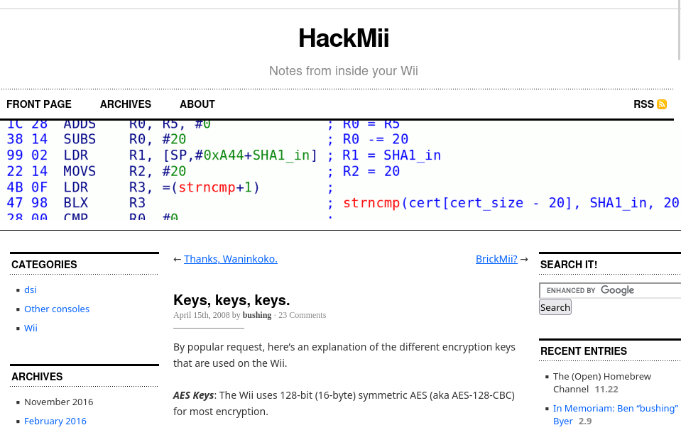
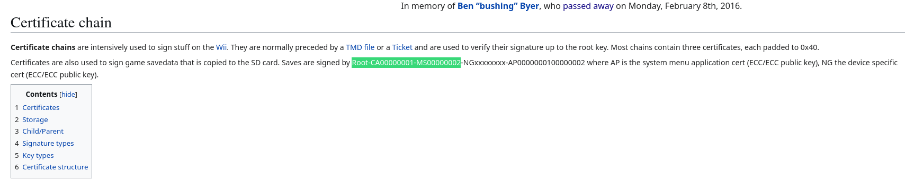
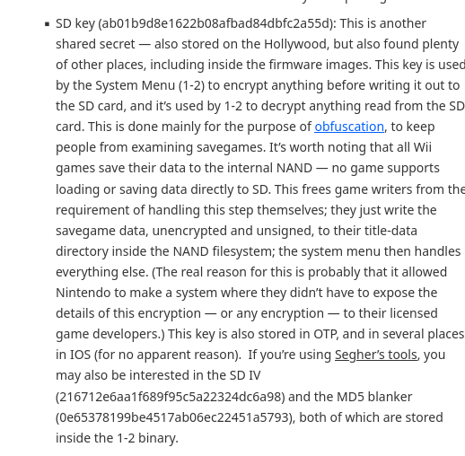

# Résolution du challenge 'Keys, keys, keys.'

## Introduction :

Avec la description du challenge, le joueur doit comprendre que la copie du support externe qui lui a été fourni est tirée d'une console de jeu. De plus, le titre est un indice direct de la plateforme visée car il s'agit d'un poste très célèbre dans la communautée de modding de cette console : 


*https://hackmii.com/2008/04/keys-keys-keys/*

Le challenge repose alors sur le déchiffrement des données contenues dans la copie et d'en extraire les informations utiles.

## Cheminement pour résoudre le challenge : 

On commence tout d'abord par monter l'image, qui est un disque virtuel de 15 Mo formaté en FAT32 : 

    mkdir /tmp/mount && sudo mount image.dd /tmp/mount

On explore alors les données contenues avec la commande `tree` :

```
/tmp/mount/
└── 19E4-3310
    └── private
        └── uii
            └── title
                └── BZPP
                    └── data.bin

6 directories, 1 file
```

On remarque alors directement un fichier data.bin qui va être intéressant à analyser. On commence par se renseigner sur la nature de celui-ci avec la commande `file` :

```
19E4-3310/private/uii/title/BZPP/data.bin: data
```

Aucun format ne ressort clairement, on regarde alors les headers du fichier pour savoir s'il s'agit d'un format moins connu :

    hexdump -C -X 19E4-3310/private/uii/title/BZPP/data.bin |head -10

```
00000000  69 b8 8e e9 c1 6c 7b b7  fc cf a9 ba 88 e5 a6 24  |i....l{........$|
0000000  69  b8  8e  e9  c1  6c  7b  b7  fc  cf  a9  ba  88  e5  a6  24
00000010  d5 f3 85 fe 21 60 cb 01  1e a5 c6 3e 05 3d 71 72  |....!`.....>.=qr|
0000010  d5  f3  85  fe  21  60  cb  01  1e  a5  c6  3e  05  3d  71  72
00000020  b3 7b f9 52 e8 5c 7c 5b  43 6f d5 23 d6 df e3 f4  |.{.R.\|[Co.#....|
0000020  b3  7b  f9  52  e8  5c  7c  5b  43  6f  d5  23  d6  df  e3  f4
00000030  1c 27 d3 5c e3 81 1a ca  cd 22 d2 0c 2b 4f 02 aa  |.'.\....."..+O..|
0000030  1c  27  d3  5c  e3  81  1a  ca  cd  22  d2  0c  2b  4f  02  aa
00000040  ec 6e 7e 9e dd c3 45 90  dc 07 07 38 c4 30 39 7d  |.n~...E....8.09}|
0000040  ec  6e  7e  9e  dd  c3  45  90  dc  07  07  38  c4  30  39  7d
```

Malheureusement, aucune signature ou indice ne ressort pour nous permettre d'identifier la nature des données. Cependant, en essayant de lire les données avec la commande `strings`, on aperçoit du texte lisible à la fin du bloc : 

```
Root-CA00000001-MS00000002
NG0403ac68
Root-CA00000001-MS00000002-NG0403ac68
AP0000000100000002
```

En cherchant alors sur un moteur de recherche, on tombe directement sur un forum parlant du certificat `Root-CA00000001-MS00000002` : 


*https://wiibrew.org/wiki/Certificate_chain*

Une autre mention dans le texte doit alors porter l'attention du joueur :

    Certificates are also used to sign game savedata that is copied to the SD card

Muni de ces informations, le joueur sait maintenant qu'il se retrouve face à des données de sauvegarde de jeux qui ont étés transférées sur carte SD depuis une console Wii. Il peut alors se renseigner sur la manière dont les données sont chiffrées depuis cette console vers la carte SD, toujours depuis le même forum :

*When copying a save game from a Wii system memory to an SD card (in "Data Management"), it encrypts it with an AES key known to all consoles (SD-key). This serves only to keep prying eyes from reading a save game file. In crypto terminology, the SD-key is a "shared secret".* 

Sachant cela, il faut alors retrouver les secrets partagés, notamment depuis le post qui porte le même nom que le challenge :



*https://hackmii.com/2008/04/keys-keys-keys/*

On retrouve alors la clé AES utilisée ainsi que le protocole, AES-128-CBC :

    SD key : ab01b9d8e1622b08afbad84dbfc2a55d
    SD IV : 216712e6aa1f689f95c5a22324dc6a98
    MD5 Blanker : 0e65378199be4517ab06ec22451a5793 (nécessaire pour le padding des données)

Le joueur a maintenant le choix de créer son propre tool pour déchiffrer les données de sauvegarde, ou bien d'utiliser un utilitaire qui le fera à sa place, comme les outils ` segher-wii-tools`. Il doit alors monter récupérer les sources, compiler les codes et exécuter `tachtig` pour déchiffrer notre fichier data.bin :

```bash
sudo apt update -y && sudo apt install git make openssl libssl-dev gcc && git clone https://github.com/Plombo/segher-wii-tools && mkdir ~/.wii
```

Puis renseigner les clés trouvées dans un répertoire `~/.wii` comme l'explique la documentation des outils :

```bash
echo ab01b9d8e1622b08afbad84dbfc2a55d | xxd -r -p - ~/.wii/sd-key
echo 216712e6aa1f689f95c5a22324dc6a98 | xxd -r -p - ~/.wii/sd-iv
echo 0e65378199be4517ab06ec22451a5793 | xxd -r -p - ~/.wii/md5-blanker
```

Puis exécuter l'outil :

```bash
tachtig /tmp/mount/private/uii/title/BZPP/data.bin
```

Ils obtiennent alors un nouveau répertoire dont ils peuvent explorer les 4 fichiers apparus :

```
###banner###.ppm: Netpbm image data, size = 192 x 64, rawbits, pixmap
###icon###.ppm:   Netpbm image data, size = 48 x 48, rawbits, pixmap
RPSports.dat:     data
###title###:      data
```

Les fichiers .ppm peuvent être ouverts avec n'importe quel utilitaire de photos, pour y découvrir le nom du jeu :


Puis la dernière partie du flag peut être simplement lu avec la commande `cat` sur le fichier '###title###' :

```
LastPArt:_W11_1z_fun}
```

On remonte les deux informations pour construire le flag final : `BZHCTF{BREIZHSports_W11_1z_fun}`