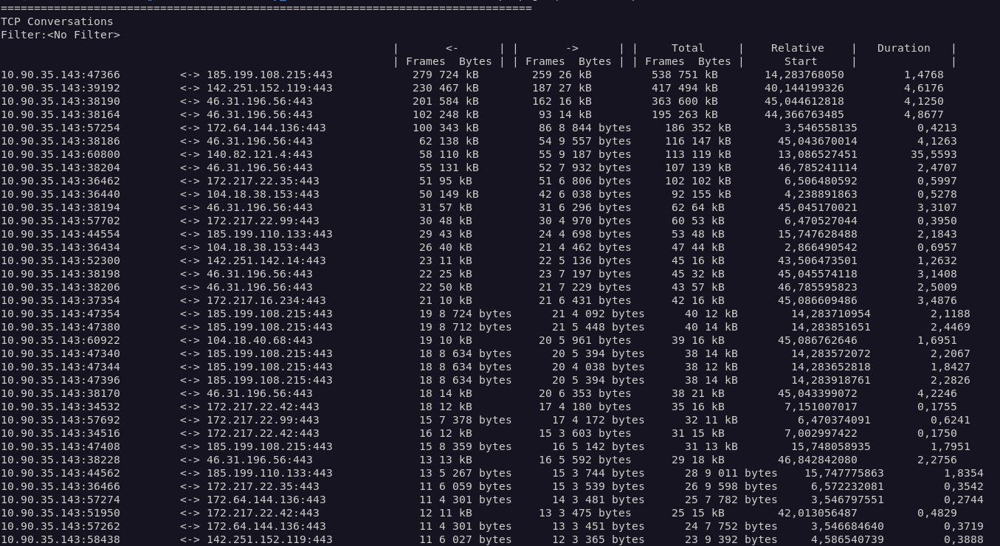
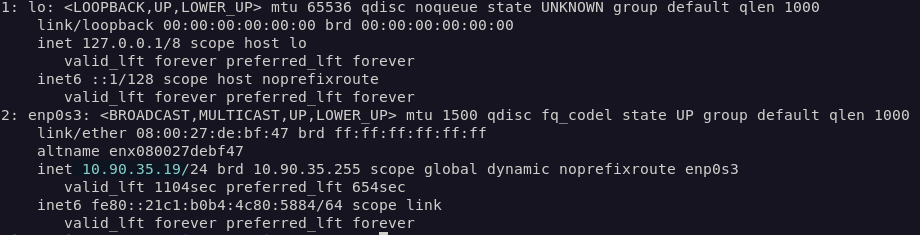
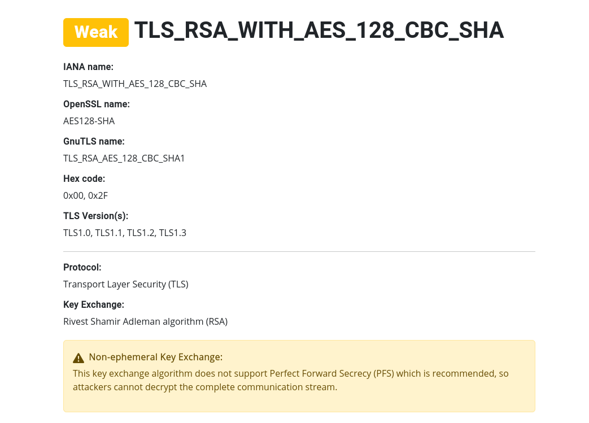
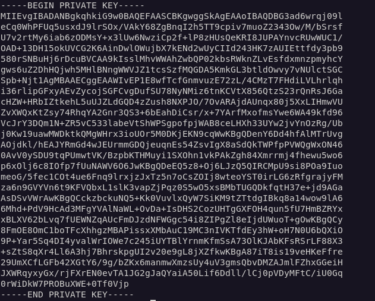
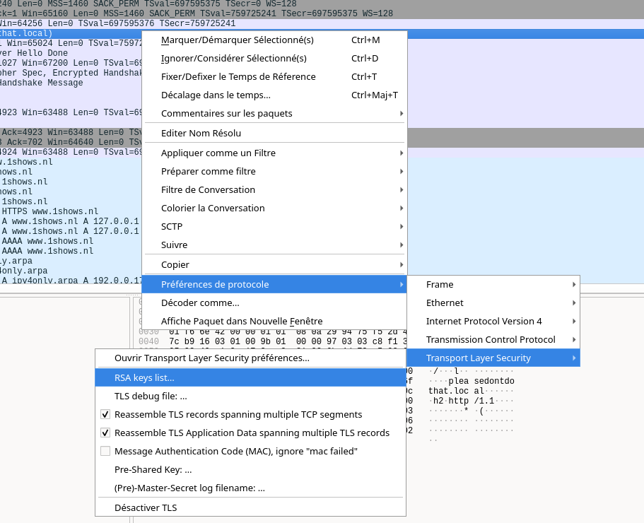
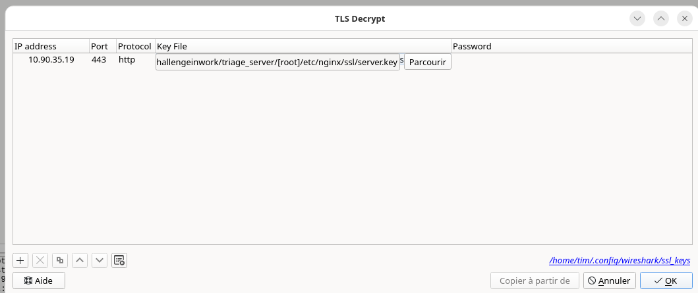
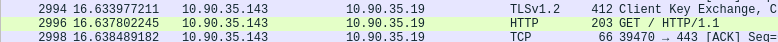
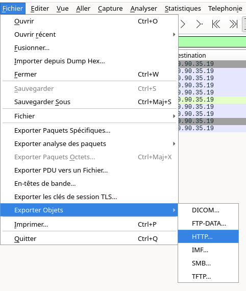
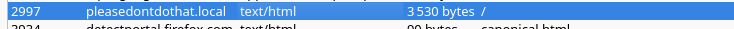
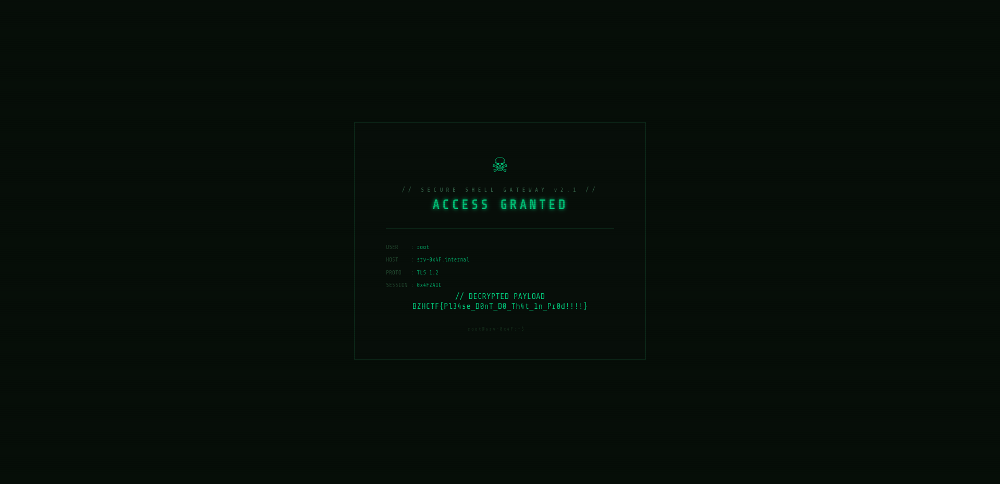

# Résolution du challenge 'Totally Secure'

## Introduction :

Ce challenge repose sur l'exploitation d'une mauvaise configuration TLS d'un serveur web. Le serveur impose des ciphers RSA sans échange de clés éphémères, ce qui signifie qu'aucune forme de Perfect Forward Secrecy n'est en place.

Contrairement aux ciphers modernes (ECDHE, DHE), la clé de session est directement chiffrée avec la clé publique RSA du serveur. Quiconque possède la clé privée peut donc rejouer le handshake et déchiffrer l'intégralité du trafic capturé.

## Cheminement pour résoudre le challenge : 

On commence par analyser le fichier `.pcapng` fourni, qui contient des trames réseau capturées. Un utilitaire comme `tshark` permet d'inspecter rapidement l'ensemble des flux, leurs adresses source et destination, ainsi que les protocoles impliqués.

```bash
tshark -r traffic.pcapng -q -z io,phs
```

On obtient alors :

``` 
===================================================================
Protocol Hierarchy Statistics
Filter: 

eth                                      frames:5832 bytes:5861970
  ip                                     frames:5824 bytes:5861598
    tcp                                  frames:3545 bytes:3817145
      tls                                frames:1124 bytes:2023922
        tcp.segments                     frames:439 bytes:1166642
          tls                            frames:343 bytes:1076253
      tcp.segments                       frames:2 bytes:1977
      http                               frames:18 bytes:13259
        ocsp                             frames:14 bytes:11836
        data-text-lines                  frames:2 bytes:646
    udp                                  frames:2277 bytes:2044229
      dns                                frames:186 bytes:18920
      quic                               frames:2091 bytes:2025309
        quic                             frames:115 bytes:116407
          quic                           frames:17 bytes:20637
    icmp                                 frames:2 bytes:224
      quic                               frames:2 bytes:224
  arp                                    frames:8 bytes:372
    text                                 frames:2 bytes:102
===================================================================
```

On remarque donc beaucoup de tls et de http, il s'agit alors majoritairement de trafic web. On essaie d'avoir plus de détails sur les conversations avec la commande suivante : 

```bash
tshark -r traffic.pcapng -q -z conv,tcp
```



On voit alors beaucoup de trafic réseau sur le port 443 (HTTPS), on observe également que la source provient d'une adresse locale en 10.90.35.143, un LAN qui pourrait être intéressant à regarder. On filtre avec les échanges uniquement sur le réseau interne avec la commande suivante :

```bash 
tshark -r traffic.pcapng -q -z conv,tcp   -2 -R "ip.src == 10.0.0.0/8 && ip.dst == 10.0.0.0/8"
```

On obtient : 

``` 
================================================================================
TCP Conversations
Filter:<No Filter>
                                                           |       <-      | |       ->      | |     Total     |    Relative    |   Duration   |
                                                           | Frames  Bytes | | Frames  Bytes | | Frames  Bytes |      Start     |              |
10.90.35.143:39470         <-> 10.90.35.19:443                  6 5 326 bytes      10 1 368 bytes      16 6 694 bytes    16,625631355         0,0137
================================================================================
```

On sait qu'un serveur web tourne alors dans le LAN à l'adresse suivante : 10.90.35.19. On peut donc se diriger vers le triage serveur qui nous est fourni. On commence par récupérer l'adresse IP du serveur pour avoir plus de contexte : 

```bash
cat live_response/network/ip_addr_show.txt
```




On comprends alors qu'on a les données du serveur web. On peut donc se renseigner sur sa configuration : 

```bash
cat \[root\]/etc/nginx/sites-available/chall
```

On récupère : 

```
server {
    listen 443 ssl;
    server_name PleaseDontDoThat.local;

    ssl_certificate     /etc/nginx/ssl/server.crt;
    ssl_certificate_key /etc/nginx/ssl/server.key;

    ssl_protocols TLSv1.2;

    ssl_ciphers "AES128-SHA:AES256-SHA:AES128-SHA256:AES256-SHA256:DES-CBC3-SHA";

    ssl_prefer_server_ciphers on;

    ssl_session_cache off;
    ssl_session_tickets on;

    root /var/www/html;
    index index.html;

    location / {
        try_files $uri $uri/ =404;
    }
}

server {
    listen 80;
    server_name pleasedontdothat.local;
    return 301 https://$host$request_uri;
}
```

le fichier de configuration nous indique alors qu'il s'agit de la bonne direction, avec le nom explicite : 

`PleaseDontDoThat.local`

On analyse alors la configuration, puis surtout le protocole de chiffrement utilisé ainsi que ses paramètres : 

```
    ssl_protocols TLSv1.2;

    ssl_ciphers "AES128-SHA:AES256-SHA:AES128-SHA256:AES256-SHA256:DES-CBC3-SHA";
```

Avec une simple recherche Google avec les Ciphers utilisés, on tombe sur un blog, `ciphersuite.info`, qui nous indique que l'utilisation de ceux-ci cause un problème de sécurité au niveau des échanges cryptographiques :


https://ciphersuite.info/cs/TLS_RSA_WITH_AES_128_CBC_SHA/

Le message d'avertissement doit directement nous attirer l'oeil : 

```
This key exchange algorithm does not support Perfect Forward Secrecy (PFS) which is recommended, so attackers cannot decrypt the complete communication stream.
```

Il indique que cet algorithme ne supporte pas le Perfect Forward Secrecy, cela signifie que la clé de session n'est pas générée de façon éphémère, mais dérivée directement à partir de la clé privée RSA du serveur. Toute capture du trafic peut donc être déchiffrée a posteriori, à condition de disposer de cette clé.

On peut alors explorer l'arborescence du dump pour vérifier s'il est possible de récupérer les clés cryptographiques. Avec la configuration, on sait où chercher : 

```
    ssl_certificate     /etc/nginx/ssl/server.crt;
    ssl_certificate_key /etc/nginx/ssl/server.key;
``` 

On regarde si on y a accès :

```bash
cat triage_server/\[root\]/etc/nginx/ssl/server.key 
```



Oui ! On passe alors sur Wireshark avec le fichier `server.key`, pour tenter de déchiffrer les communications vers ce serveur. On peut le faire en modifiant les propriétées du protocole : 



On précise les bons paramètres :



On remarque alors qu'on obtient le trafic HTTP en clair : 



On peut essayer de l'ouvrir en exportant les objets HTTP : 



Puis : 



On ouvre avec firefox : 



On récupère le flag final :

```
BZHCTF{Pl34se_D0nT_D0_Th4t_1n_Pr0d!!!!}
```

PS : Désolé pour la page web mais c'est tout l'IA qu'à fait.