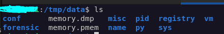
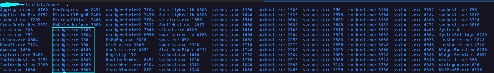
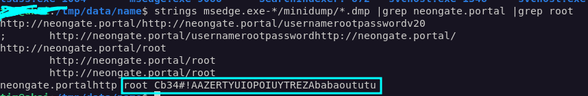

# WriteUP INTERIUT 2026 - Forensic - By Design

## Résumé :
Ce challenge, composé d'une copie de la mémoire d'une machine Windows 11, se porte sur la fonctionnalité géniale qu'a Microsoft de conserver en clair l'ensemble des mots de passse dans la mémoire des processus Edge, son navigateur intégré.

## Résolution : 

On commence par décompresser l'archive xz qui nous est fournie : 

```bash
xz -d memdump.raw.xz
```

Par la suite, on analyse la mémoire avec un outil comme `memprocfs` (https://github.com/ufrisk/memprocfs) : 

```bash
mkdir /tmp/data && ./memprocfs -f memdump.raw -mount /tmp/data -forensic 1
```

Grâce à cet outil, on peut accéder aux fichiers de la mémoire comme un filesystem classique, en se dirigeant dans le répertoire précédemment créé `/tmp/data` :



Dans le répertoire `forensic`, on peut récupérer l'historique web extrait de la mémoire : 

```bash
cat forensic/web/web.txt
```

```
     #    PID                    Time  Browser Type     Url :: Info
-------------------------------------------------------------------
     0   7184 2026-05-07 21:49:25 UTC  EDGE    VISIT    https://www.bing.com/WS/Init :: Recherche
     1   8840 2026-05-07 21:37:18 UTC  EDGE    LOGINPWD http://neongate.portal/ :: root
     2   8840 2026-05-07 21:37:14 UTC  EDGE    VISIT    http://neongate.portal/ :: 405 Not Allowed
     3   8840 2026-05-07 21:36:41 UTC  EDGE    VISIT    http://neongate.portal/ :: 405 Not Allowed
     4   8840 2026-05-07 21:36:31 UTC  EDGE    VISIT    https://www.bing.com/search?q=neongate.portal&cvid=3214f6b1e8fd426197b6ea2aa1548ab5&gs_lcrp=EgRlZGdlKgYIABBFGDkyBggAEEUYOdIBCTE2NTExajBqN6gCALACAA&FORM=ANNTA1&PC=U531 :: neongate.portal - Recherche
     5   8840 2026-05-07 21:36:10 UTC  EDGE    VISIT    https://www.microsoft.com/edge/update/?form=MT00ZZ&channel=stable&version=147.0.3912.98&sg=0 :: Nouveautés Microsoft Edge
     6   8840 2026-05-07 21:36:10 UTC  EDGE    VISIT    https://www.microsoft.com/fr-fr/edge/update/147?ep=1910&es=335&form=MT00ZZ&channel=stable&version=147.0.3912.98&sg=0&cs=1174669073 :: Nouveautés Microsoft Edge
     7   7184 2026-05-07 21:33:32 UTC  EDGE    VISIT    https://www.bing.com/WS/Init :: Recherche
     8   7184 2026-05-07 21:24:16 UTC  EDGE    VISIT    https://www.bing.com/WS/Init :: Recherche
     9   7184 2026-05-07 21:20:50 UTC  EDGE    VISIT    https://www.bing.com/WS/Init :: Recherche
     a   7184 2026-04-07 19:20:13 UTC  EDGE    VISIT    https://www.bing.com/WS/Init :: Recherche
     b   7184 2026-04-04 09:29:18 UTC  EDGE    VISIT    https://www.bing.com/WS/Init :: Recherche
```

Une ligne nous intéresse particulièrement, qui est celle du type `LOGINPWD`, qui indique une connexion de l'utilisateur `root` sur le site `neongate.portal` :

```
1   8840 2026-05-07 21:37:18 UTC  EDGE    LOGINPWD http://neongate.portal/ :: root
```

Tout bêtement, on remarque que les processus qui impliquent un navigateur web sont sous la forme `msedge.exe` dans le répertoire `name` :



On fait alors un bête ̀`grep` pour aller fouiller dans la mémoire des processus la référence du site récupéré ainsi que de l'utilisateur root : 

```bash
strings msedge.exe-*/minidump/*.dmp |grep neongate.portal |grep root
```

On obtient alors le mot de passe en clair : 



Flag : 

```
interiut{Cb34#!AAZERTYUIOPOIUYTREZAbabaoututu}
```