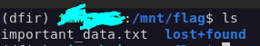

# WriteUP INTERIUT 2026 - Forensic - Neural Vault

## Résumé :
Ce challenge, composé d'une copie de la mémoire d'une machine Debian 13, se porte sur l'analyse de RAM et des services pour déchiffrer un bloc de données LUKSv2.

## Résolution : 

On commence par analyser la nature du dump de RAM pour récupérer du contexte ave volatility3 - installable avec `pip` : 

```bash
python3 -m venv dfir && source dfir/bin/activate && pip install volatility3 && vol -f memory.dump banners.Banners
```

On récupère les informations suivantes : 

```
Volatility 3 Framework 2.28.0
Progress:  100.00		PDB scanning finished                  
Offset	Banner

0xa34bd88	Linux version 6.12.85+deb13-amd64 (debian-kernel@lists.debian.org) (x86_64-linux-gnu-gcc-14 (Debian 14.2.0-19) 14.2.0, GNU ld (GNU Binutils for Debian) 2.44) #1 SMP PREEMPT_DYNAMIC Debian 6.12.85-1 (2026-04-30)
```

On confirme alors que le fichier de symboles fourni (`6.12.85+deb13-amd64.json`) correspond bien à la machine dont le dump de RAM a été récupéré. On peut donc l'utiliser pour analyser le fichier `memory.dump`, dans le répertoire symbols généré dans notre venv :

```bash
mkdir -p dfir/lib/python3.13/site-packages/volatility3/symbols/linux && cp 6.12.85+deb13-amd64.json dfir/lib/python3.13/site-packages/volatility3/symbols/linux/
```

On peut donc maintenant utiliser vol3 correctement, on commence par l'analyse des dernières commandes sur la machine : 

```bash
vol -f memory.dump linux.bash.Bash
```

Mais on obtient rien d'intéressant : 

```
Volatility 3 Framework 2.28.0
Progress:  100.00		Stacking attempts finished           
PID	Process	CommandTime	Command

856	bash	2026-05-07 21:04:25.000000 UTC	su -
856	bash	2026-05-07 21:04:25.000000 UTC	su -
856	bash	2026-05-07 21:04:25.000000 UTC	exit
856	bash	2026-05-07 21:04:25.000000 UTC	su - 
856	bash	2026-05-07 21:04:25.000000 UTC	ls
856	bash	2026-05-07 21:04:25.000000 UTC	su -
866	bash	2026-05-07 21:07:55.000000 UTC	cat /root/.bash_history 
866	bash	2026-05-07 21:08:55.000000 UTC	echo "" > /root/.bash_history 
866	bash	2026-05-07 21:08:57.000000 UTC	ls
866	bash	2026-05-07 21:09:02.000000 UTC	./avml --help
866	bash	2026-05-07 21:09:02.000000 UTC	 
866	bash	2026-05-07 21:09:02.000000 UTC	 
866	bash	2026-05-07 21:09:16.000000 UTC	./avml memory.dump
```

On cherche alors les points de montage, pour récupérer du contexte sur l'image chiffrée fournie : `neonvault.img` :

```bash
$vol -f memory.dump linux.mountinfo.MountInfo |grep vault

4026531841 100.052	30	254:0ing/attempt/mnt/milsec_vault       rw,relatime	shared:132	ext4	/dev/mapper/milsec_vault	rw
4026532287	57	68	254:0	/	/mnt/milsec_vault	rw,relatime	shared:135 master:132	ext4	/dev/mapper/milsec_vault	rw
4026532288	56	128	254:0	/	/mnt/milsec_vault	rw,relatime	shared:134 master:132	ext4	/dev/mapper/milsec_vault	rw
4026532369	55	171	254:0	/	/mnt/milsec_vault	rw,relatime	shared:133 master:132	ext4	/dev/mapper/milsec_vault	rw
```

On remarque alors qu'un conteneur `milsec_vault` est monté sur la machine, ça nous intéresse alors. On comprend que la clé doit être stockée quelque part sur la machine dans la RAM.

On continue notre investigation en listant les processus actifs : 

```bash
vol -f memory.dump linux.psaux.PsAux
```

On observe alors un processus suspect :

```
[...]
678	1	qemu-ga	/usr/sbin/qemu-ga
684	1	systemd-logind	/usr/lib/systemd/systemd-logind
726	1	python3	/usr/bin/python3 /opt/milsec/vault_service.py
737	1	agetty	/sbin/agetty -o -- \u --noreset --noclear - linux
739	1	sshd	sshd: /usr/sbin/ss
[...]
```

Qui est : 

```
726	1	python3	/usr/bin/python3 /opt/milsec/vault_service.py
```

On peut alors chercher si le fichier est présent dans le cache de la mémoire :

```bash
vol -f memory.dump linux.pagecache.Files | grep vault_service.py
```

On obtient le résultat suivant qui confirme que oui :

```bash
0x8dfbb3269800.0/	8:1	786437 ng 0x8dfb86f87338 sh REG     1       1	-rw-rw-r--	2026-05-07 20:33:15.000000 UTC	2026-05-06 20:30:54.000000 UTC	2026-05-06 20:30:54.000000 UTC	/opt/milsec/vault_service.py	1320
```

Avec l'information de l'adresse de l'inode récupéré (structure de données du système de fichiers Linux qui stocke les métadonnées d'un fichier - permissions, timestamps, pointeurs vers les blocs de données - mais pas son nom), on récupère le fichier original :

```bash
vol -f memory.dump linux.pagecache.InodePages --inode 0x8dfb86f87338 --dump
```

Un fichier `inode_0x8dfb86f87338.dmp` est alors généré, on peut donc le lire pour obtenir le code python original : 

```python
import subprocess
import time
import sys
import os

VAULT_IMG = "/opt/milsec/neonvault.img"
VAULT_MAP = "milsec_vault"
VAULT_MNT = "/mnt/milsec_vault"

def initialize():
    enc_key = "Sd8_#!CdkE42FR"
    print("[+] MilSec Vault Service v2.4.1 - Starting...")

    subprocess.run(["cryptsetup", "luksClose", VAULT_MAP], capture_output=True)

    os.makedirs(VAULT_MNT, exist_ok=True)

    result = subprocess.run(
        [
            "cryptsetup", "luksOpen",
            "--batch-mode",
            VAULT_IMG,
            VAULT_MAP
        ],
        input=enc_key.encode(),
        capture_output=True
    )

    if result.returncode != 0:
        print(f"[-] Erreur luksOpen (code {result.returncode})")
        print(f"    STDOUT : {result.stdout.decode()}")
        print(f"    STDERR : {result.stderr.decode()}")
        sys.exit(1)

    print("[+] Vault déchiffré")

    result = subprocess.run(
        ["mount", f"/dev/mapper/{VAULT_MAP}", VAULT_MNT],
        capture_output=True
    )

    if result.returncode != 0:
        print(f"[-] Erreur mount : {result.stderr.decode()}")
        subprocess.run(["cryptsetup", "luksClose", VAULT_MAP])
        sys.exit(1)

    print(f"[+] Vault monté sur {VAULT_MNT}")
    print("[+] Service en attente...")

    while True:
        time.sleep(60000)

initialize()
```

Le code étant explicite, on récupère la clé de chiffrement du conteneur : `Sd8_#!CdkE42FR`. Avec cette information, on peut alors monter le volume :

```bash
sudo cryptsetup luksOpen neonvault.img ctf_vol && sudo mkdir -p /mnt/flag && sudo mount /dev/mapper/ctf_vol /mnt/flag
```

On peut alors lister les fichiers dans le nouveau répertoire : 



On récupère le flag dans `important_data.txt` : 

```
SU5URVJJVVR7MWU5MWZhMmRjOTM4ZGYyOTU0ODQwNzUyOTQ3YzIzYTc5YzljNzhhNzZjNmMwYzNjfQ==
```

On est face à du base64, on décode alors :

```
echo -n "SU5URVJJVVR7MWU5MWZhMmRjOTM4ZGYyOTU0ODQwNzUyOTQ3YzIzYTc5YzljNzhhNzZjNmMwYzNjfQ==" |base64 -d
```

Qui donne notre flag : 

```
INTERIUT{1e91fa2dc938df2954840752947c23a79c9c78a76c6c0c3c}
```
